# Brandon Wroblewski's Portfolio

I am a senior Computer Science student at North Carolina State University with a focus on cybersecurity, software engineering, and AI. My academic journey is complemented by hands-on experience in research, internships, and personal projects, allowing me to bridge theory with practical application.

As a Software Security Researcher, I have contributed to multiple publications in IEEE conferences (ICDM, ACSAC, ASE) and Springer KAIS, focusing on cyberthreat intelligence, temporal attack patterns, and automated code analysis. I am passionate about using AI and machine learning to enhance security, automate analysis, and improve software reliability.

Beyond research, I have gained industry experience as a Software Engineer Intern at Astro AI Trading, building backend systems in Go with PostgreSQL, and as a Resident Advisor, fostering community and mentoring students. I also actively participate in ethical hacking competitions and hands-on security labs through HackPack and TryHackMe.

I thrive on learning, problem-solving, and building impactful software. Whether developing scalable applications, analyzing security threats, or mentoring peers, I approach challenges with curiosity, precision, and a collaborative mindset.

### 📑 Table of Contents
- [Experience](#experience)
  - [Software Security Researcher at NCSU](#software-security-researcher-at-ncsu)
  - [Software Engineer Intern at Astro AI Trading (Startup)](#software-engineer-intern-at-astro-ai-trading-startup)
  - [Resident Advisor at NCSU](#resident-advisor-at-ncsu)
  - [Summer Student Outreach Leader at NCSU](#summer-student-outreach-leader-at-ncsu)
  - [Cashier at Harris Teeter](#cashier-at-harris-teeter)
- [Education](#education)
  - [North Carolina State University](#north-carolina-state-university)
  - [Leesville Road High School](#leesville-road-high-school)
- [Publications](#publications)
  - [ChronoCTI: Mining Knowledge Graph of Temporal Relations Among Cyberattack Actions (ICDM, IEEE)](#chronocti-mining-knowledge-graph-of-temporal-relations-among-cyberattack-actions)
  - [Towards a Taxonomy of Challenges in Security Control Implementation (ACSAC, IEEE)](#towards-a-taxonomy-of-challenges-in-security-control-implementation)
  - [Mining Temporal Attack Patterns from Cyberthreat Intelligence Reports (Knowledge and Information Systems, Springer Nature)](#mining-temporal-attack-patterns-from-cyberthreat-intelligence-reports)
  - [Build It Clean: Large-Scale Detection of Code Smells in Build Scripts (ASE, IEEE)](#build-it-clean-large-scale-detection-of-code-smells-in-build-scripts)
- [Personal Projects](#personal-projects)
  - [Inventory and Staff Management Platform](#inventory-and-staff-management-platform)
  - [Security Home-Labs](#security-home-labs)
  - [Data-structure and Algorithm Workshops](#data-structure-and-algorithm-workshops)
  - [Implemented SHA-256 in C](#implemented-sha-256-in-c)
- [Certifications](#certifications)
  - [CompTIA Security+](#comptia-security)
  - [Pre Security Learning Path](#pre-security-learning-path)
- [Organizations](#organizations)
  - [HackPack](#hackpack)
  - [National Honor Society](#national-honor-society)
  - [Key Club](#key-club)

    
# Experience

## Software Security Researcher at NCSU

Dates: Aug 2023 - Present

Description:

Currently a Undergraduate Security Researcher under the mentorship of Dr. Laurie, working on projects at the intersection of software, security, and AI. This work has resulted in publications at IEEE-ICDM 2024, IEEE-ACSAC 2024, IEEE-ASE 2025, and in the Springer Knowledge and Information Systems (KAIS 2025).

August 2023 - December 2023: Trained a RoBERTa model on 1.34 million adversary technique pairs to analyze cyber reports and establish chronological sequences of events, achieving precision rates of 77% (concurrent), 65% (before), 97% (null), and 61% (simultaneous), ultimately pinpointing 718 instances across 124 unique temporal patterns.

January 2024 - June 2024: Categorized challenges in implementing 821 ATT&CK security controls by collecting 2,463 responses from ChatGPT, Gemini, and Bing Copilot. Extracted 1,824 themes, consolidating them into 73 challenges across 8 categories (e.g., Cost, Disruption, Human Factors). Mapped 4,315 control-challenge pairs to build a taxonomy of real-world issues, while also training and onboarding a new research assistant.

January 2025 - May 2025: Conducted a large-scale empirical study on build script quality across 4,877 OSS repos (5,882 scripts, 2,000 issues), identifying 13 smell categories (10,895 instances). Developed Sniffer, a static analysis tool (89% precision/88% recall), which outperformed six state-of-the-art LLMs (e.g., ChatGPT-4o, Mistral, LLaMA) in zero-shot detection (best LLM recall: 61.75%).

## Software Engineer Intern at Astro AI Trading (Startup)

Dates: Sept 2024 - Dec 2024

Description: I completed a semester-long internship at Astro AI Trading (Startup), where I focused on implementing functionality in the backend. My responsibilities included coding, debugging, and deploying features while collaborating closely with the development team. During my time at Astro AI, I successfully Developed group management functionalities in Go, with PostgreSQL for data storage. Implemented entities, repositories, and controllers for groups, members, and forums resulting in 14 Okta authenticated API endpoints for the application. I also enhanced search functionality by implementing data sanitation, adding tags, and incorporating near-accuracy measurements, improving both security and user experience.

## Resident Advisor at NCSU

Dates: Aug 2023 - Present

Description: As a Resident Advisor during the 2023–2024 and 2025–2026 academic years, I thrive in creating an inclusive and vibrant campus community by planning engaging events that foster student connections and personal growth. My responsibilities include assisting first-year students as they transition to college life, mediating conflicts, and planning community-building events that promote connection and belonging.

## Summer Student Outreach Leader at NCSU

Dates: May 2024 - Aug 2024

Description: Supported a free, credit-bearing climate change course for incoming students, helping them earn 3 humanities credits prior to their start-date. Assisted with grading assignments, hosting office hours, and providing academic support throughout the course. Organized and led monthly Q&A sessions to guide new students on dorm life, class management, campus resources, and student employment

## Cashier at Harris Teeter

Dates: July 2020 - Aug 2021

Description: Diligently served as a part-time Cashier at Harris Teeter while excelling as a full-time student at Leesville Road High School. Skillfully handled customer transactions, efficiently operated self-checkouts, and provided exceptional customer service. Collaborated with various departments, showcasing adaptability and teamwork. #CustomerService #RetailExperience #TeamPlayer

# Publications

## ChronoCTI: Mining Knowledge Graph of Temporal Relations Among Cyberattack Actions

URL: https://ieeexplore.ieee.org/document/10884120

Publisher: Published in the Annual International Conference on Data Mining (ICDM) by IEEE.

Publication Date: 9/12/2024

Description: Cyberthreat intelligence (CTI) reports on past cyberattacks describe the sequence of actions of attackers in terms of time. The sequence contains temporal relations among attack actions, such as a malware is first downloaded and then executed. Information related to temporal relations enables cybersecurity practitioners to investigate past cyberattack incidents and analyze attackers' behavior. However, cybersecurity practitioners must extract such information automatically, in a structured manner, through a common vocabulary to reduce human effort and enable sharing, and collaboration. The goal of this paper is to aid security practitioners in proactive defense against attacks by automatic information extraction of temporal relations among attack actions from cyberthreat intelligence reports. We propose ChronoCTI, an automated pipeline for extracting temporal relations among attack actions from CTI reports. The attack actions are represented as MITRE ATT&CK techniques, and the relations are represented as a knowledge graph. To construct ChronoCTI, we build a ground truth dataset of temporal relations and apply large language models, natural language processing, and machine learning techniques. ChronoCTI demonstrates higher precision but lower recall performance on a real-world dataset of 94 CTI reports. ChronoCTI achieves macro precision, recall, and F1 scores of 0.75, 0.46, and 0.54, respectively. ChronoCTI aids practitioners in analyzing large volumes of CTI reports, thinking like attackers, and knowing what attack actions are likely to happen next, which enables the practitioners to assess imminent threats and strengthen their cybersecurity readiness.

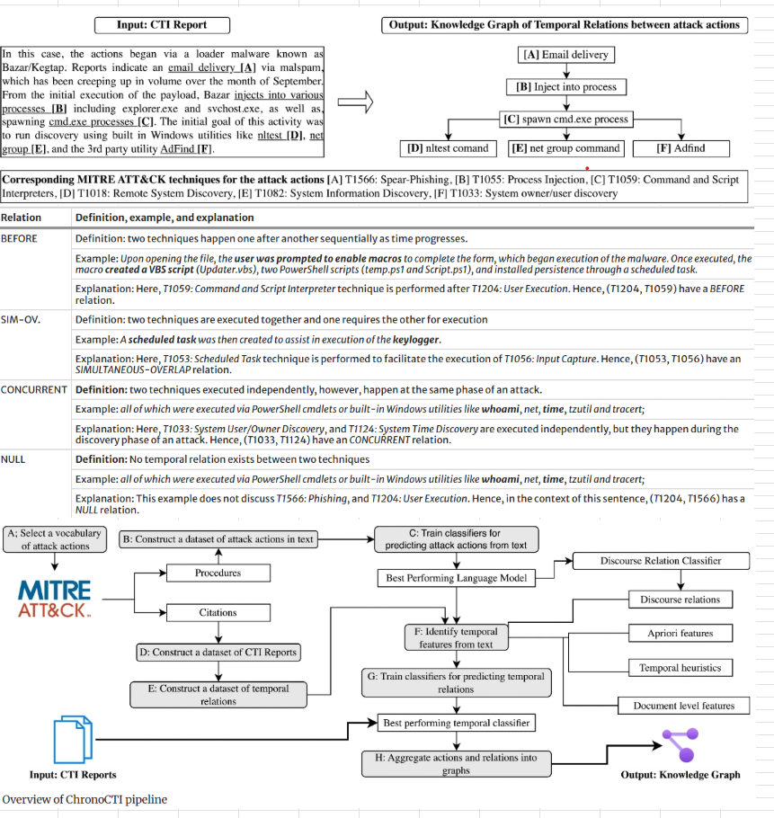

## Towards a Taxonomy of Challenges in Security Control Implementation

URL: https://ieeexplore.ieee.org/document/10917356

Publisher: Published in the Annual Computer Security Applications Conference (ACSAC) by IEEE.

Publication Date: 9/13/2024

Description: Cybersecurity researchers and practitioners identify and design security controls (e.g., the use of strong passwords), which refer to the countermeasures and safeguards to protect information systems’ confidentiality, integrity, and availability. The effectiveness of controls depends on their implementation. However, controls may have technical and operational issues that challenge effective implementation. Systematizing such challenges would benefit practitioners in enhancing their defense. The goal of this study is to aid security practitioners in defending against cyberattacks by constructing a taxonomy of challenges in security control implementation. We first obtain information regarding the challenges of implementing security control, cataloged in MITRE ATT&CK, using three Large Language Models: ChatGPT, Gemini, and Copilot. Then, using inductive coding and reflexive thematic analysis, we construct a taxonomy comprising 73 challenges across 8 high-level categories and map the taxonomy with the security controls. We perform a case study on attack techniques in MITRE ATT&CK to identify the challenges associated with security controls for mitigating prevalent attack techniques. We identify that 9 out of 24 prevalent attack techniques do not have any security controls. The rest of the prevalent techniques can be defended. However, the effectiveness of the controls associated with the rest of the prevalent techniques can be limited due to the following: human resources requirements, false positive issues, static detection rules, disruption, and user inconvenience. Our work highlights that security control implementation is subjective, where a diverse set of organizational, technical, human, and external factors can impact its implementation. We recommend organizations not treating security controls as a ticking-off checklist, rather resolve the impeding issues in their implementation.

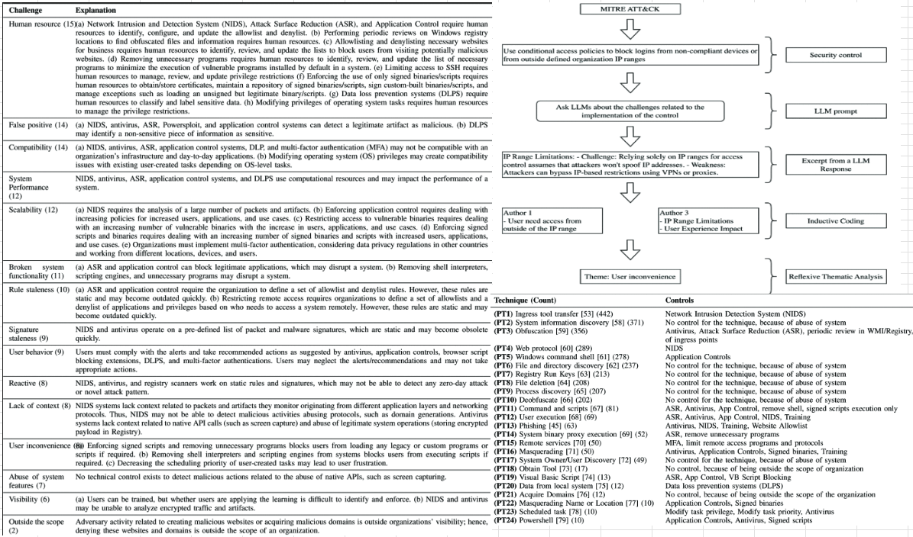

## Mining temporal attack patterns from cyberthreat intelligence reports

URL: https://link.springer.com/article/10.1007/s10115-025-02491-6?utm_source=rct_congratemailt&utm_medium=email&utm_campaign=oa_20250722&utm_content=10.1007/s10115-025-02491-6

Publisher: Published in Knowledge and Information Systems by Springer Nature

Publication Date: 5/13/2025

Description: ChronoCTI is an automated system that extracts temporal relations among cyberattack actions from cyberthreat intelligence (CTI) reports. By mapping actions to MITRE ATT&CK techniques and structuring them as a knowledge graph, ChronoCTI helps security practitioners understand attacker behavior and support proactive defense. Built using large language models, NLP, and machine learning, ChronoCTI achieves high precision on real-world CTI data. Analysis of 713 reports revealed 124 recurring attack patterns across 9 categories, with the most common involving user deception and malware evasion. The findings support using ChronoCTI for designing defenses such as user training, system hardening, and automated detection of recurring threats.

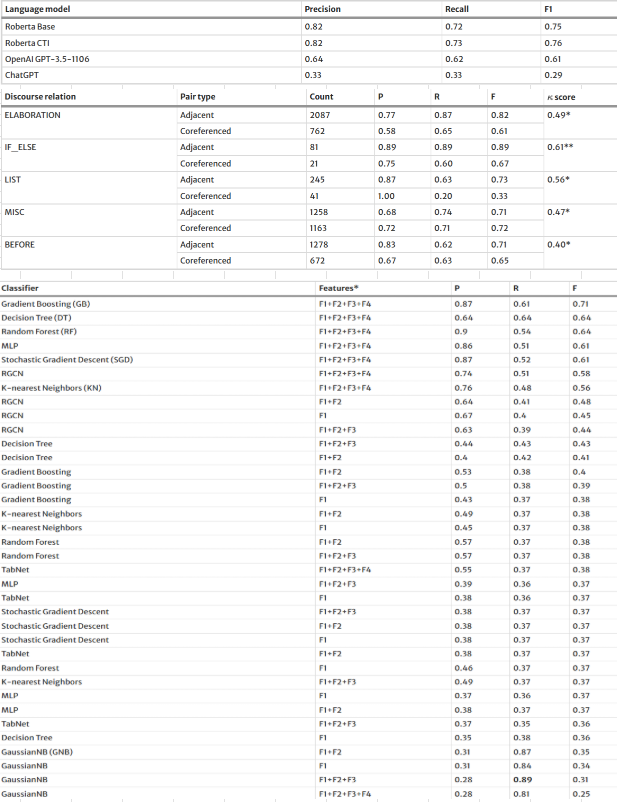
 
## Build It Clean: Large-Scale Detection of Code Smells in Build Scripts

URL: https://arxiv.org/abs/2506.17948

Publisher: Published in the 2025 Conference on Automated Software Engineering (ASE) by IEEE.

Publication Date: 8/17/2025

Description: "Build It Clean: Large-Scale Detection of Code Smells in Build Scripts", which has been accepted for IEEE ASE-2025 and will be presented in November 2025! The attached article is the rough draft of the paper, the official paper will be published in IEEE mid-October 2025. This study investigates code smells in build scripts, which automate software compilation, dependency management, testing, and packaging. Through qualitative analysis of 2,000 GitHub issues and static analysis of 5,882 build scripts from 4,877 repositories, we identified 13 categories of code smells, totaling 10,895 occurrences. Insecure URLs were most common in Maven, Hardcoded Paths/URLs in Gradle and CMake, and Wildcard Usage in Makefiles. Co-occurrence patterns revealed structural issues, such as links between hardcoded paths and duplicates. We propose mitigation strategies to enhance build script reliability, efficiency, and maintainability.

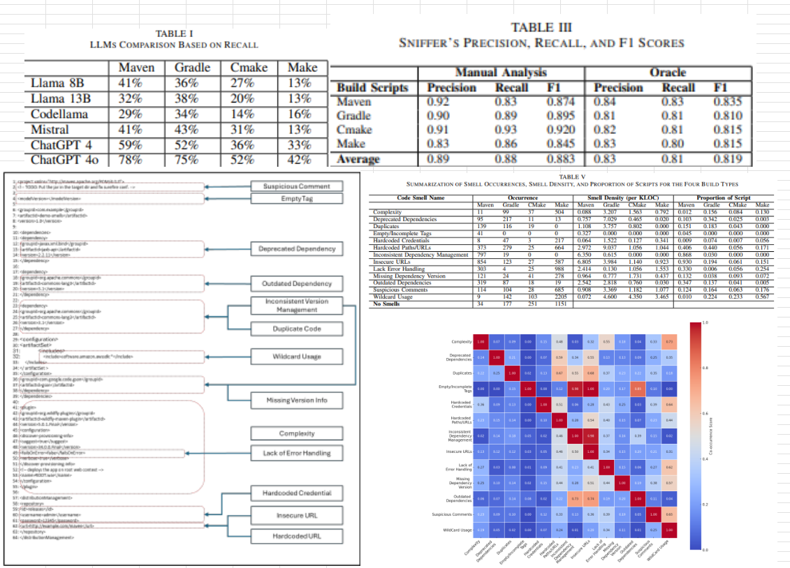

# Education

## North Carolina State University

Grade: SeniorGrade: Senior

Activities and societies: Student Outreach Leader | Resident Advisor | Weight Lifting and Tennis | Research Assistant | HackPack Member

Through coursework and collaboration with talented engineers, I developed applications from scratch, building a solid foundation in software engineering.

In the cybersecurity field, I gained hands-on experience through security-focused courses, undergraduate research, and my involvement in HackPack. I participated in Capture the Flag (CTF) competitions, where I sharpened my skills, and contributed to my first publication in the field.

Additionally, my involvement in group projects, research, and as a Resident Advisor helped me significantly improve my communication and conflict management skills, working closely with diverse teams to achieve shared goals.

The NC State environment made this possible thanks to my peers, professors, and bosses—Go Pack!

## Leesville Road High School

Activities and societies: Football | Key Club Member | National Honor Society Member | Part-Time Harris Teeter Associate

# Personal Projects

## Inventory and Staff Management Platform

### Link
https://github.com/BrandonWrob/ExtendedManager

### Overview

A full-stack store management application with database management, automated testing, role-based features, built-in security, and a user friendly interface. I originally developed this project as part of a small team using Agile-Scrum methodologies, including sprint planning, biweekly stand-ups, and detailed documentation (Javadocs, UML diagrams, and system tests). I’m now continuing to expand the project alongside other peers who are using it as a foundation to explore new frameworks, add functionality, and enhance the system’s overall capabilities. 

🔧 Features
- 🔐 Secure login with JWT authentication & role-based access (Customers, Staff, Managers, Admins)
- 👥 Role-based access with custom features and UI for Customers, Staff, Managers, and Admins
- 🧾 User, Inventory, Ingredient, Recipe, History, and Order Management Features
- 🧪 90%+ automated test coverage (JUnit, Jest) through a Jenkins CI/CD pipeline.
- 📊 Manager analytics dashboard (in progress)
  
🧰 Tech Stack
- ☕ Backend: Java, Spring Boot (REST, JWT), JUnit
- ⚛️ Frontend: JavaScript, React, Jest
- 🛠️ Build: Maven, Node.js, npm
- 📈 Database: MySQL (Automated Testing), Amazon Aurora (Application)
- 🗄️ Logs: AWS CloudWatch

### UML Design

Ongoing development includes enhanced analytics for managers and deeper AWS cloud service integration.
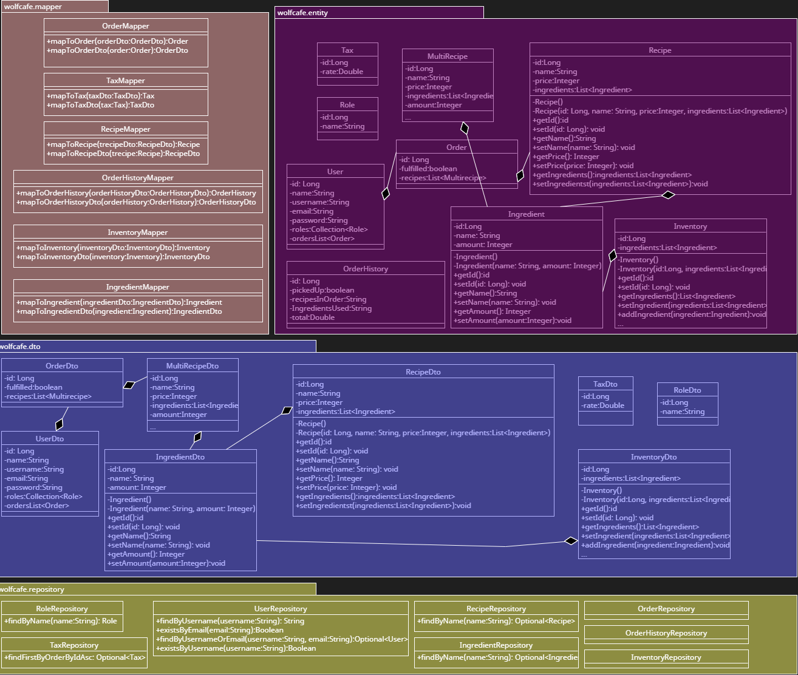
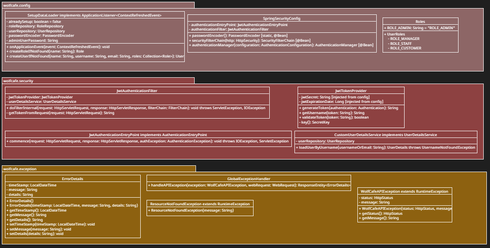
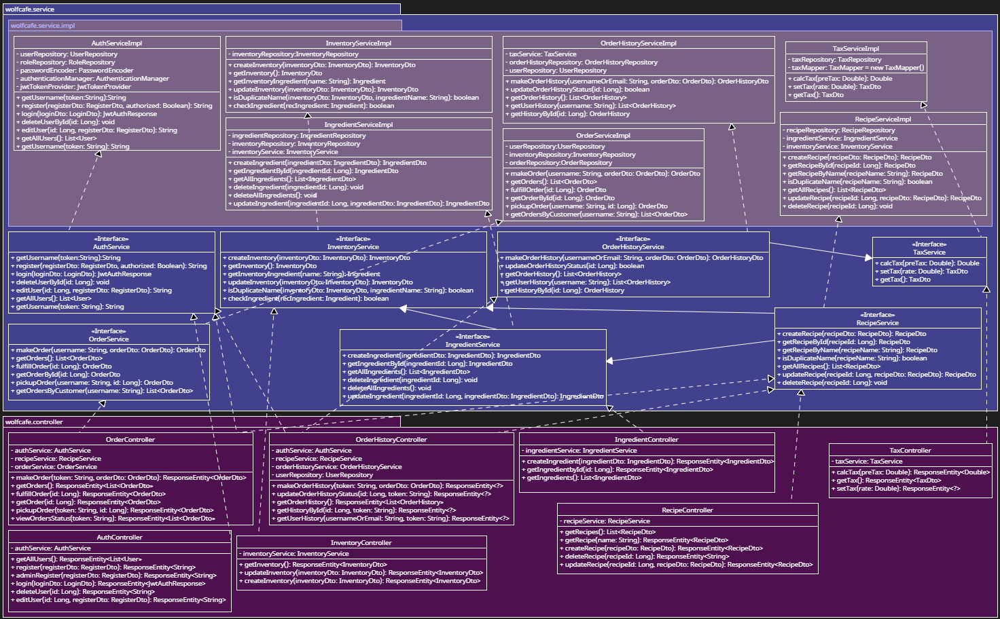

## Security Home-Labs

When I have free time I try to engaged on TryHackMe (Account: https://tryhackme.com/p/Bnwrob); completed the Pre-Security track and currently progressing through the Cyber Security 101 path.

Active member of the HackPack club where I participate in CTF tournaments to hone my security skills. Have participated in Knight CTF 2025, x3CTF 2025, Hackpack CTF 2025.

Conducted hands-on testing of security vulnerabilities including injection attacks (SQL, XSS, shellcode), request forgeries (CSRF, SSRF), broken access controls, and weak encryption. Also performed binary reverse engineering of ELF files using Ghidra.

Performed a comprehensive security assessment of OpenEMS using tools such as Browser DevTools, OWASP Dependency-Check, OWASP ZAP, and Snyk, identifying 93 vulnerable dependencies, insecure session expiration, login-related denial-of-service risks, insufficient server-side validation, and MIME sniffing vulnerabilities—all of which were reported and accepted via their GitHub repository.

## Data-structure and Algorithm Workshops

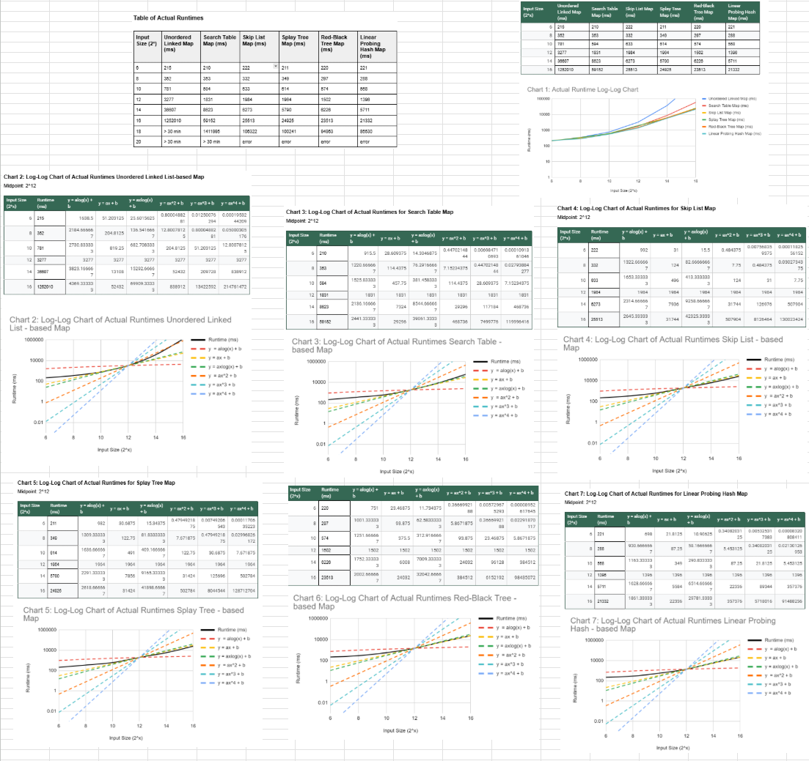

Implemented and optimized a variety of data structures from scratch in Java including array-based lists and queues, linked lists, stacks, general and binary search trees, balanced search trees, up-trees, hash tables with advanced collision resolution techniques, heaps, and graph representations via adjacency lists and matrices

Developed and applied a comprehensive range of algorithms, including iterative, recursive, and sorting (Bubble, Insertion, Selection, Merge, Quick, Heap, Counting, Radix) techniques, alongside tree traversals and graph algorithms (Bi-Directional BFS, DFS, Minimum Spanning Trees, Shortest Paths). Leveraged computational paradigms such as Divide and Conquer, Brute-Force, Dynamic Programming, and Greedy Algorithms for optimized problem-solving.

Worked on complexity analysis for space and efficiency by comparing hypothetical and real runtimes and space usage across diverse structures and algorithms. Found worst-case scenarios rarely accurate, while average case more accurate for large inputs; recursive structures proved unreliable for substantial data. The paper can be found at [here](ExperimentReport.pdf)

Note: This project is stored in a private repository due to regulations that prohibit posting course-related work publicly. However, I’m permitted to share and discuss the code during interviews with non-students—feel free to message me if you’re interested!

## Implemented SHA-256 in C

Implemented a full SHA-256 hashing algorithm in C, adhering closely to the FIPS 180-4 standard. The implementation includes:

Bitwise rotation logic via a modular rotate() function for 32-bit words.

Core logical functions (Ch, Maj, Σ0, Σ1, etc.) as defined in the SHA-256 specification.

Message parsing and expansion: Converts 64-byte message blocks into 64 32-bit words using a combination of byte-wise shifts and XOR-based extension logic.

Padding according to SHA-256 rules: appends a 1 bit, followed by zeroes, and ends with the 64-bit representation of the message length.

Compression function: Processes each block with 64 rounds of transformation using SHA-256 constants (K[t]), temporary working variables (A–H), and two derived terms T1 and T2 per round.

State management: Dynamically allocates and zero-initializes a SHAState struct to track current hash values, pending message bytes, and total processed length.

Incremental hashing support: The update() function processes arbitrary-length data in a streaming fashion, chunking it into 512-bit blocks and queuing incomplete blocks.

Final digest computation: Finalizes the hash with proper padding and length encoding, then outputs the 256-bit (32-byte) digest as 8 32-bit words.

This implementation emphasizes portability and transparency, using only standard C libraries (stdlib.h, string.h) and explicit bitwise operations instead of relying on platform-specific intrinsics.

Note: This project is stored in a private repository due to regulations that prohibit posting course-related work publicly. However, I’m permitted to share and discuss the code during interviews with non-students—feel free to message me if you’re interested!

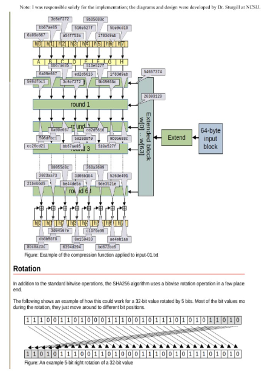
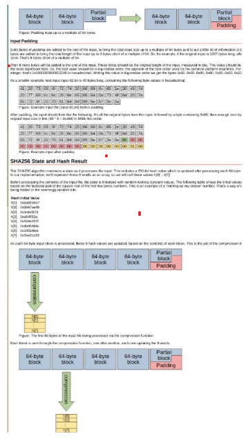
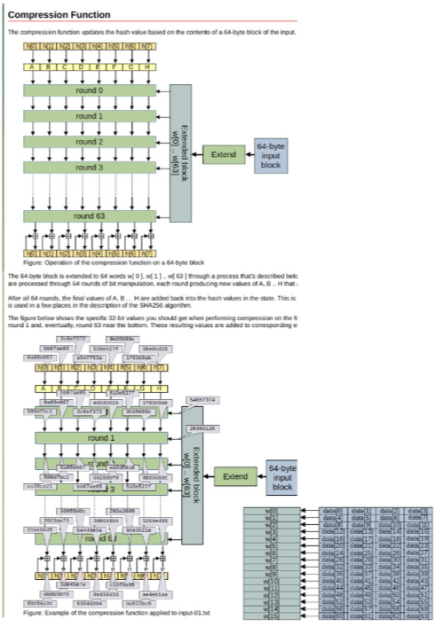
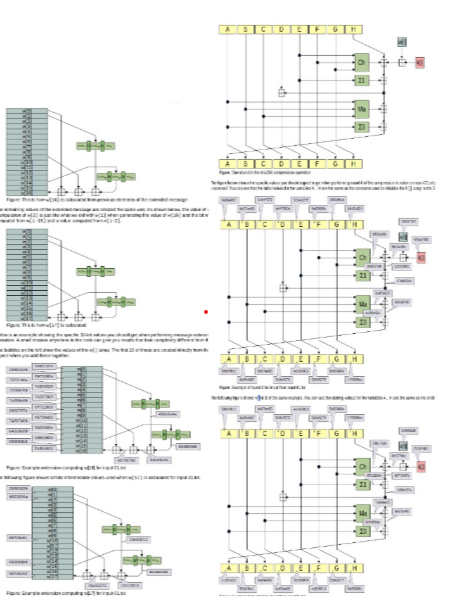

# Certifications

## CompTIA Security+

Issued: May 2025

ID: COMP001022402515

URL: https://www.credly.com/badges/8d4a48da-d53c-4da9-82f0-6be18a157091/linked_in_profile

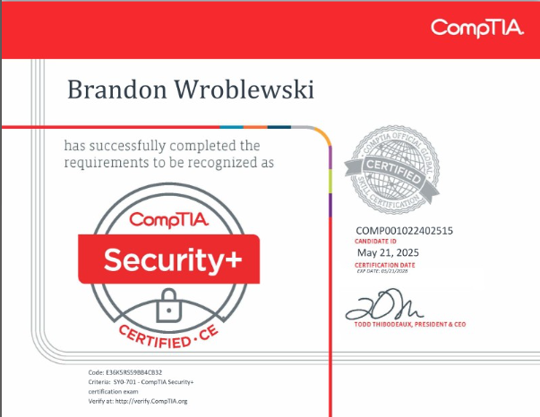

## Pre Security Learning Path

Issued: June 2025

URL: https://tryhackme-certificates.s3-eu-west-1.amazonaws.com/THM-Z81AOD2FL9.png

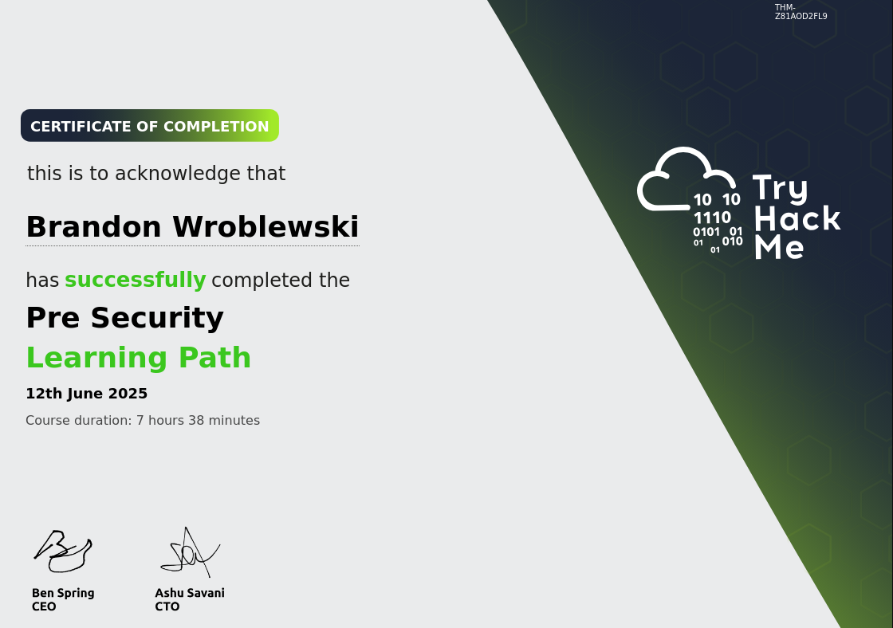

# Organizations

## HackPack

Current member of HackPack at NCSU, where I actively attend weekly meetings and workshops, and participate in Capture the Flag (CTF) challenges to gain practical experience in ethical hacking.

## National Honor Society

Was a member of the National Honor Society (NHS), where I attended weekly meetings and volunteered at various events to help out the school.

## Key Club

Was a member of Key Club in highschool at Leesville Road High School, where I engaged in volunteer work both within my school and in the community, including organizations such as the Raleigh Tennis Association and events like the State Fair.
